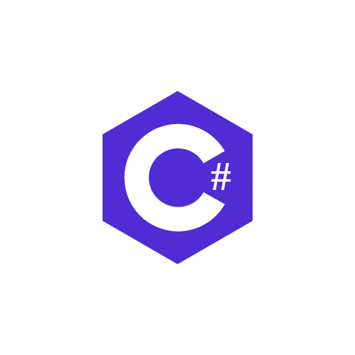
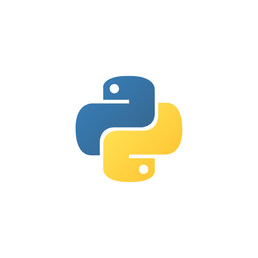
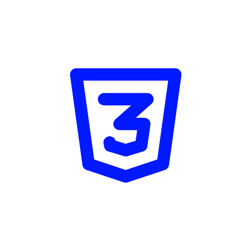
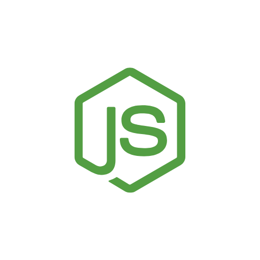
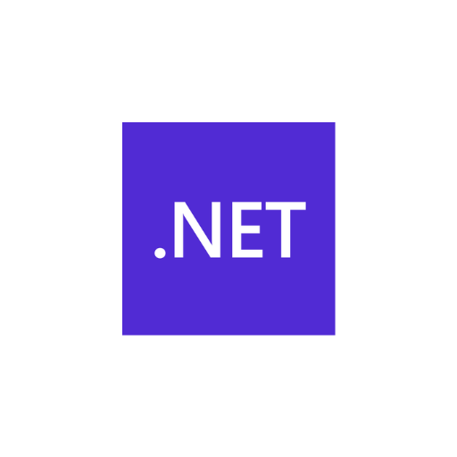
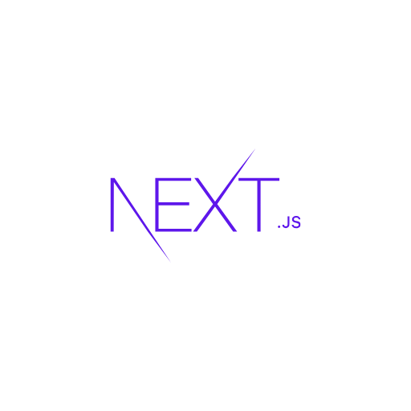
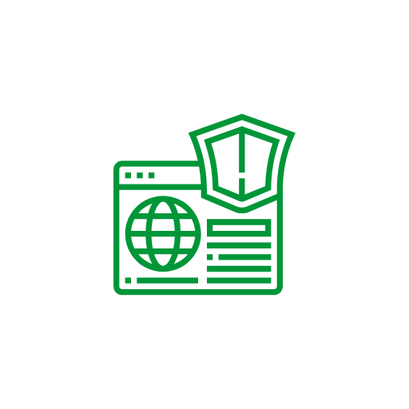

## 🎯 Sobre Mim
🚀 Desenvolvedor Full-Stack | Análise de Dados | Ethical Hacking 

## 🎓 Formação Acadêmica
**Tecnólogo em Sistemas para Internet** – IFB (Cursando) | **Tecnólogo em Banco de Dados e Big Data** – IESB (Cursando)  

## 💻 Linguagens

    
    
    
    
    
    
    
    

    

## 📖 Bibliotecas & Frameworks

    
    
    
    
    
    

    

## 🎯 Soft Skills
💡 Proatividade | 🔥 Determinação | 🏆 Resiliência | 🗣 Comunicação | 📊 Pensamento Analítico  
